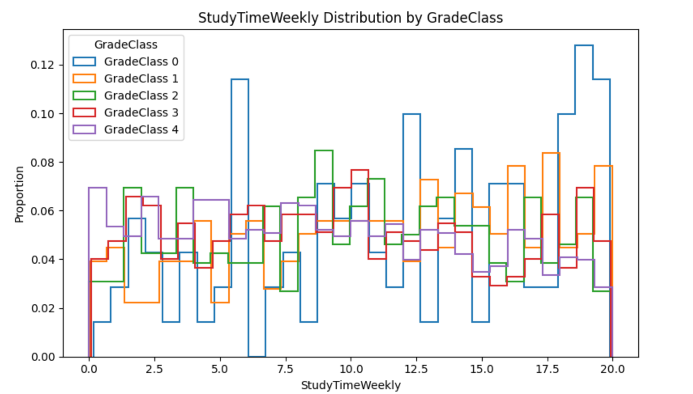
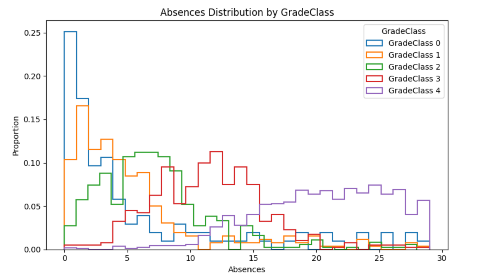
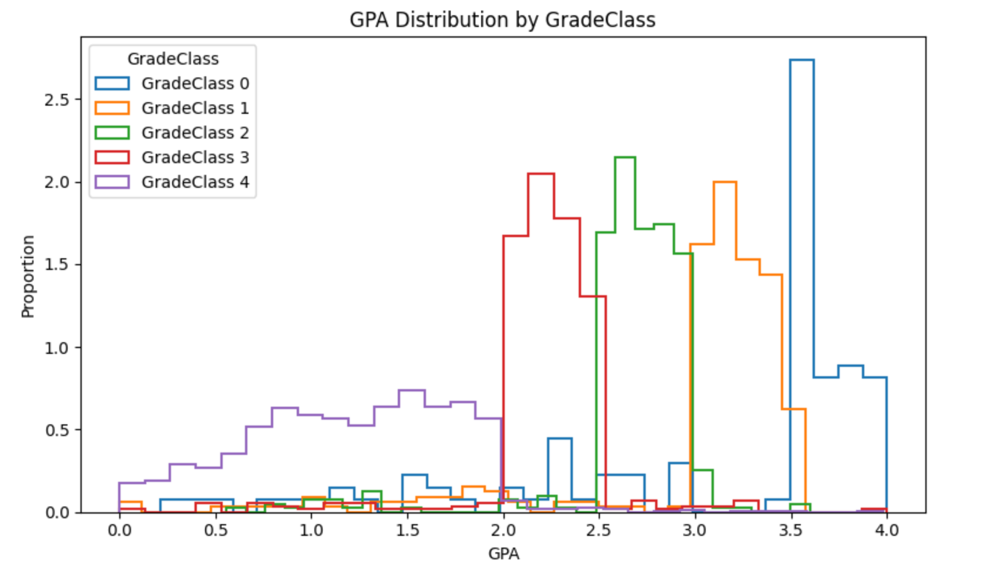
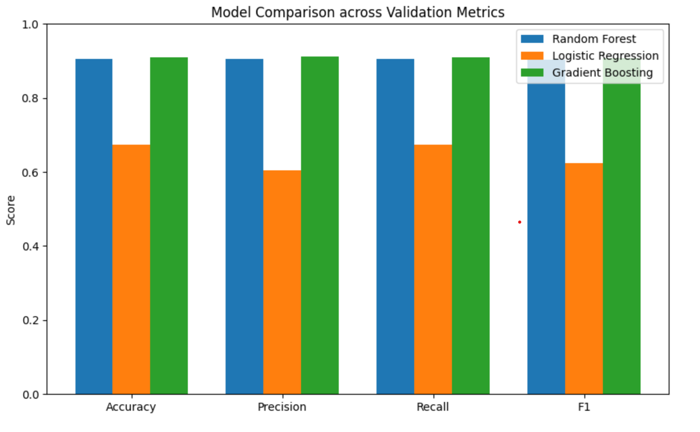
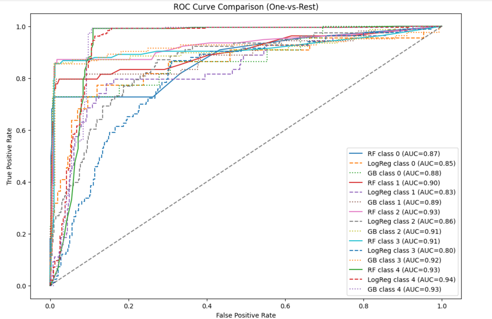

# Student Performance Prediction

## One Sentence Summary
This repository predicts student grade classes (A–F) using a tabular dataset of demographics, study habits, and extracurricular activities.

---

## Overview
The goal of this project is to predict a student’s grade class (A–F, encoded as 0–4) using demographic, study habits, and activity-related features from a tabular dataset. We formulated this as a multi-class classification problem and trained three models (Random Forest, Logistic Regression with One-vs-Rest, and Gradient Boosting) on a cleaned and standardized dataset. We compared their performance using accuracy, precision, recall, F1-score, and ROC curves. Random Forest and Gradient Boosting performed best, achieving validation accuracies over 90%, while Logistic Regression performed less strongly. These results show the value of supervised machine learning to help identify at-risk students and inform potential interventions.

---

## Summary of Work Done

### Data

- **Type**: Tabular CSV  
- **Input**: Student features (age, gender, parental education, weekly study time, extracurricular participation, absences, GPA, etc.)  
- **Output**: Grade class (0 = A, 1 = B, 2 = C, 3 = D, 4 = F)  
- **Size**: 2392 students total  
  - Train: 1434
  - Validation: 479
  - Test: 479

---

### Preprocessing / Clean up

- Dropped irrelevant columns (StudentID)
- Confirmed the target column `GradeClass` was integer-encoded
- Standardized numerical features (`Age`, `StudyTimeWeekly`, `Absences`, `GPA`) using `StandardScaler`
- Verified no missing values or duplicates

---

### Data Visualization

- Normalized histograms of numeric features by grade class
- Bar plots for activity-based features (sports, music, volunteering)
- Outlier detection (IQR) on study time and absences
- Grouped bar plots comparing model metrics
- One-vs-rest ROC curve comparisons for each grade class

Insights included that higher weekly study time and parental support related to higher grades, while higher absences correlated with lower grades.




---

## Problem Formulation

- **Input**: Tabular student features after preprocessing  
- **Output**: Multi-class classification, predicting grade class 0–4

---

### Models

- **Random Forest Classifier**  
- **Logistic Regression (One-vs-Rest)**  
- **Gradient Boosting Classifier**

Hyperparameters were left largely at default to establish a prototype baseline, except for increasing Logistic Regression's max iterations to 1000.

---

## Training

- **Software**: Python 3, Jupyter/Colab  
- **Libraries**: pandas, numpy, matplotlib, scikit-learn  
- **Split**: 60% train, 20% validation, 20% test  
- **Environment**: Google Colab (CPU)

Training took under 5 minutes per model.

---

## Performance Comparison

| Model                 | Accuracy | Precision | Recall | F1 Score |
|:----------------------|:---------|:----------|:-------|:---------|
| Random Forest         | 0.906    | 0.906     | 0.906  | 0.904    |
| Logistic Regression   | 0.674    | 0.605     | 0.674  | 0.624    |
| Gradient Boosting     | 0.910    | 0.911     | 0.910  | 0.908    |


ROC curves for each grade class were plotted to evaluate discriminative ability, showing Random Forest and Gradient Boosting performed similarly well.

### ROC Curve Comparison

## Conclusions

Random Forest and Gradient Boosting proved to be effective for this multi-class classification task, achieving strong balanced F1-scores over 90%. Logistic Regression performed less well due to the complex, non-linear nature of the problem. Key predictors of student performance included study time, parental support, absences, and GPA.

---

## Future Work

- Test XGBoost or LightGBM  
- Perform hyperparameter tuning with grid or randomized search  
- Engineer new features (e.g., a combined “engagement” score)  
- Include time-series features like daily attendance trends

---

## How to Reproduce Results

1. Clone this repository  
2. Open `StudentPerformance.ipynb`  
3. Install dependencies:
    ```bash
    pip install pandas numpy scikit-learn matplotlib
    ```
4. Run all cells in order  
5. *(Optional)* create a prediction CSV for a simulated submission

---

## Overview of Files in Repository

| File                               | Description                                      |
|:-----------------------------------|:-------------------------------------------------|
| `StudentPerformance.ipynb`         | Main notebook with the full pipeline              |
| `cleaned_student_data.csv`         | Cleaned, scaled dataset                           |
| `Student_performance_data _.csv`       | Original dataset from Kaggle                      |
| `Fesabily.ipynb`                  | Checking fesability of the project                 |
| `Prototype.ipynb`                     | Prototype(First Model Trained)                    |


---

## Software Setup

- Python 3  
- pandas  
- numpy  
- scikit-learn  
- matplotlib

---

## Data

- Provided in CSV format  
- Alternatively, raw data can be re-preprocessed using the provided notebook

---

## Performance Evaluation

Run all notebook cells in `StudentPerformance.ipynb` to reproduce metrics and plots, including ROC curves and grouped bar plots comparing model performance.

---

## Citation

> Rabie El Kharoua
> [Student Performance Dataset](https://www.kaggle.com/datasets/rabieelkharoua/students-performance-dataset)

